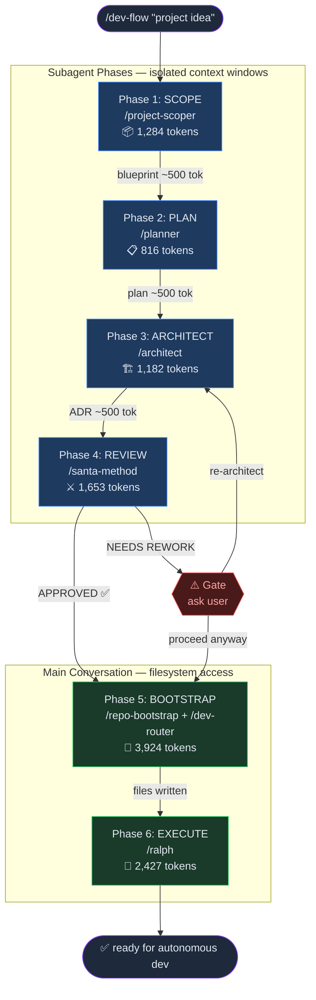

<div align="center">

# Dev Flow

**End-to-end autonomous development pipeline for Claude Code**

From project idea to running code in one command.

[](https://docs.anthropic.com/en/docs/claude-code)
[](LICENSE)

</div>

---



---

## What is this?

Dev Flow is a **skill pipeline** for [Claude Code](https://docs.anthropic.com/en/docs/claude-code) that orchestrates 7 specialized skills into a single development workflow. Instead of manually chaining `/scope` → `/plan` → `/architect` → `/review` → `/bootstrap` → `/ralph`, you run one command:

```
/dev-flow "Build a SaaS project management tool with auth, real-time updates, and Stripe billing"
```

Claude scopes the project, plans implementation phases, designs architecture, stress-tests decisions through adversarial review, bootstraps the repo with verification scripts and CI, then hands off to Ralph for autonomous iterative development.

## The Problem: Skill Bloat

A naive approach would merge all skills into one mega-skill. Here's why that fails:

```
┌──────────────────────────────────────────────────────┐
│  Mega-Skill loaded into context                      │
│                                                      │
│  project-scoper    ████████  1,284 tokens            │
│  planner           █████     816 tokens              │
│  architect         ██████    1,182 tokens            │
│  santa-method      █████████ 1,653 tokens            │
│  repo-bootstrap    █████████████████  3,424 tokens   │
│  ralph             ████████████  2,427 tokens        │
│                                                      │
│  TOTAL: 12,457 tokens loaded EVERY invocation        │
│  Even when you only need one skill (307 tokens)      │
└──────────────────────────────────────────────────────┘
```

Claude's context window is finite. Every token spent on skill definitions is a token unavailable for your actual conversation, code, and reasoning.

## The Solution: Subagent Architecture

Dev Flow uses a **thin orchestrator** (~2,300 tokens) that spawns subagents for each phase. Each subagent loads only the skill it needs, does deep work in its own context, and returns a compressed summary (~500 tokens). The main conversation stays lean.

```
Main Context                          Subagent Contexts
┌─────────────────────┐
│ dev-flow  2,348 tok │
│                     │    Phase 1 ┌──────────────────┐
│ ──── spawn ────────→│───────────→│ project-scoper   │
│                     │            │ 1,284 tok        │
│ ← blueprint 500 tok│←───────────│ deep scoping...  │
│                     │            └──────────────────┘
│                     │               ↑ released
│                     │    Phase 2 ┌──────────────────┐
│ ──── spawn ────────→│───────────→│ planner          │
│                     │            │ 816 tok          │
│ ← plan 500 tok     │←───────────│ deep planning... │
│                     │            └──────────────────┘
│                     │               ↑ released
│                     │    Phase 3 ┌──────────────────┐
│ ──── spawn ────────→│───────────→│ architect        │
│                     │            │ 1,182 tok        │
│ ← ADR 500 tok      │←───────────│ deep design...   │
│                     │            └──────────────────┘
│                     │               ↑ released
│                     │    Phase 4 ┌──────────────────┐
│ ──── spawn ────────→│───────────→│ santa-method     │
│                     │            │ 1,653 tok        │
│ ← consensus 400 tok│←───────────│ adversarial...   │
│                     │            └──────────────────┘
│                     │               ↑ released
│ Phase 5: bootstrap  │
│ (writes files here) │  ← runs in main (needs filesystem)
│                     │
│ Phase 6: ralph cmd  │  ← outputs invocation
└─────────────────────┘

Main context total: ~4,600 tokens (orchestrator + 4 summaries)
Mega-skill would be: ~12,457 tokens (and no deep work per phase)
```

### Token Budget Comparison

| Approach | Main Context Cost | Deep Work Quality | Can Handle Long Conversations |
|----------|-------------------|-------------------|------------------------------|
| **Mega-skill** | 12,457 tok (fixed) | Shallow — competing for attention | Hits limit faster |
| **Sequential skills** | ~10,000 tok (accumulates) | Medium — but context grows | Degrades over time |
| **Dev Flow (subagents)** | ~4,600 tok (stable) | Deep — each agent gets full window | Stays lean throughout |

**Dev Flow saves ~63% context** vs the mega-skill approach, while giving each phase a full context window for deep reasoning.

## Pipeline Architecture

```
/dev-flow "your project idea"
    │
    ├── Phase 1: SCOPE ──────── subagent ──── project-scoper
    │   Classifies project type, filters 21 development
    │   dimensions to only what matters, suggests tech stack
    │
    ├── Phase 2: PLAN ───────── subagent ──── planner
    │   Breaks project into phases, each independently
    │   deliverable with specific steps and test criteria
    │
    ├── Phase 3: ARCHITECT ──── subagent ──── architect
    │   System design, ADRs with trade-off analysis,
    │   component structure, data model
    │
    ├── Phase 4: REVIEW ─────── subagent ──── santa-method
    │   Adversarial review: attack weak points, defend
    │   or concede, produce stress-tested consensus
    │   ⚠️  GATE: NEEDS REWORK → stops and asks user
    │
    ├── Phase 5: BOOTSTRAP ──── main conversation ──── repo-bootstrap + dev-router
    │   Generates: scripts/verify.sh, .claude/agents/reviewer.md,
    │   CLAUDE.md, GitHub CI — then registers project in Dev Router
    │   for one-click launching from localhost:4000
    │
    └── Phase 6: EXECUTE ────── main conversation ──── ralph
        Outputs the /ralph-loop invocation with verification
        gates and reviewer checkpoints baked into the prompt

Available on-demand during development:
    /frontend-design ─── when building UI components
    /web-design-guidelines ─── when reviewing UI quality
    /skill-agent ─── when you need a capability not installed
```

## Included Skills

| Skill | Purpose | Tokens | Standalone Use |
|-------|---------|--------|---------------|
| **dev-flow** | Orchestrator — routes through all phases | 2,348 | `/dev-flow "build X"` |
| **project-scoper** | Scope & filter 21 dev dimensions | 1,284 | `/project-scoper "todo app"` |
| **planner** | Implementation phases & steps | 816 | `/planner` |
| **architect** | System design & ADRs | 1,182 | `/architect` |
| **santa-method** | Adversarial consensus protocol | 1,653 | `/santa-method` |
| **repo-bootstrap** | verify.sh + reviewer + CLAUDE.md | 3,424 | `/repo-bootstrap` |
| **ralph** | Gated autonomous loop (wraps ralph-loop plugin) | 2,427 | `/ralph "fix auth bug"` |
| **dev-router** | Register project in local launcher dashboard | 510 | `/dev-router` |

Every skill works independently. The orchestrator is optional — you can invoke any skill directly.

## Installation

```bash
git clone https://github.com/Angelov1314/dev-flow.git
cd dev-flow
bash install.sh
```

This copies skills to `~/.claude/skills/` where Claude Code auto-discovers them.

### Prerequisites

- [Claude Code](https://docs.anthropic.com/en/docs/claude-code) CLI installed
- [Ralph Loop plugin](https://docs.anthropic.com/en/docs/claude-code/plugins) installed (ships with Claude Code official marketplace)

Verify Ralph is available:
```bash
# In Claude Code, run:
/ralph-loop --help
```

## Usage

### Full Pipeline

```bash
# One command, end-to-end
/dev-flow "Build a SaaS todo app with auth, real-time sync, and Stripe billing"
```

Dev Flow will:
1. Classify as SaaS, filter to ~14/21 development dimensions
2. Break into 4-5 implementation phases
3. Design architecture with ADRs
4. Stress-test via adversarial review (stops if NEEDS REWORK)
5. Generate `scripts/verify.sh`, reviewer agent, `CLAUDE.md`
6. Output the Ralph invocation to start autonomous development

### Individual Skills

```bash
# Just scope a project
/project-scoper "real-time collaborative whiteboard"

# Just plan implementation
/planner

# Just do architecture
/architect

# Just stress-test a decision
/santa-method

# Just bootstrap a repo
/repo-bootstrap

# Just run autonomous dev
/ralph "implement user auth with JWT"
```

### Skip Phases

```bash
# Already have a plan? Skip to architecture
/dev-flow "just architect"

# Already designed? Skip to bootstrap
/dev-flow "just bootstrap"
```

## How Ralph Works

Ralph is **not** the built-in `/loop` command. It uses the official Anthropic **ralph-loop plugin** which works via a Stop hook:

```
/ralph-loop "Your task" --completion-promise 'DONE' --max-iterations 20

Claude works on task
    │
    ├── tries to exit
    │       │
    │   Stop hook intercepts ──→ checks <promise> tag
    │       │                         │
    │       │                    not found
    │       │                         │
    │   re-feeds SAME prompt ←────────┘
    │       │
    │   Claude sees previous work in files + git
    │       │
    │   iterates, improves
    │       │
    └── outputs <promise>DONE</promise> ──→ hook allows exit
```

Dev Flow's `/ralph` skill adds quality gates **inside the prompt**:
- Must run `scripts/verify.sh` and get exit code 0
- Must invoke the reviewer agent and get PASS verdict
- Only then can output `<promise>DONE</promise>`

Three profiles auto-selected by task complexity:

| Profile | Max Iterations | Use Case |
|---------|---------------|----------|
| Sprint | 10 | Bug fix, config change, docs |
| Build | 20 | Feature, multi-file change |
| Marathon | 50 | Refactor, migration, large feature |

## Project Scoper: The 21-Dimension Filter

Instead of a generic checklist, the scoper classifies your project and filters:

| Project Type | Dimensions Used | Dimensions Skipped |
|-------------|----------------|-------------------|
| Landing Page | ~8 of 21 | Backend, Database, Queues, Billing... |
| SaaS Product | ~18 of 21 | Minimal skips |
| API Service | ~10 of 21 | Visual Design, UX, Frontend... |
| Data Pipeline | ~6 of 21 | Frontend, UX, Billing, Marketing... |

A landing page doesn't need "message queues" or "multi-tenant architecture". The scoper prevents scope bloat at the source.

## Design Decisions

### Why subagents instead of sequential skill loading?

Claude Code skills load into context and **don't unload**. Loading 7 skills sequentially means all 7 stay in context simultaneously — equivalent to a mega-skill. Subagents get their own context window, do deep work, and release it when done.

### Why Phases 5-6 run in the main conversation?

Subagents run in isolated contexts. They can read files but writing to the working directory is unreliable. Phases 5 (bootstrap) and 6 (ralph) need to write `verify.sh`, `reviewer.md`, and `CLAUDE.md` to the actual repo.

### Why Santa Method for review instead of a simple checklist?

Adversarial review catches problems that checklists miss. The Santa Method forces the architecture through structured attack-and-defend rounds, producing a stress-tested consensus with documented trade-offs — not just a "looks good to me."

### Why gate on Phase 4?

If the architecture review returns NEEDS REWORK, continuing to bootstrap and execute would waste time building on a flawed foundation. The gate stops the pipeline and asks the user whether to re-architect or proceed anyway.

## File Structure

```
dev-flow/
├── README.md
├── LICENSE
├── install.sh                          # One-command installer
├── .gitignore
├── skills/
│   ├── dev-flow/
│   │   └── SKILL.md                    # Orchestrator (~2,300 tokens)
│   ├── project-scoper/
│   │   ├── SKILL.md                    # Scoping agent
│   │   └── references/
│   │       └── development-checklist.md # 21-dimension reference
│   ├── repo-bootstrap/
│   │   └── SKILL.md                    # Repo setup agent
│   ├── ralph/
│   │   └── SKILL.md                    # Gated autonomous loop
│   ├── architect/
│   │   └── SKILL.md                    # Architecture design
│   ├── planner/
│   │   └── SKILL.md                    # Implementation planning
│   ├── santa-method/
│   │   └── SKILL.md                    # Adversarial review
│   └── dev-router/
│       └── SKILL.md                    # Local project launcher registration
└── docs/
    └── token-budget.md                 # Detailed token analysis
```

## Architecture Diagrams

See [docs/architecture.md](docs/architecture.md) for the full visual breakdown:
- Subagent context isolation model
- Token budget bar chart (Dev Flow vs alternatives)
- Full skill dependency map
- Phase 5 bootstrap detail
- Ralph Stop Hook sequence diagram

## Token Budget Deep Dive

See [docs/token-budget.md](docs/token-budget.md) for the full analysis, including:
- Per-phase token accounting
- Comparison with alternative architectures
- Context window sustainability over long sessions
- Why 500-word summaries are the sweet spot

## License

MIT

## Credits

- [Ralph Wiggum technique](https://ghuntley.com/ralph/) by Geoffrey Huntley
- [Ralph Loop plugin](https://github.com/anthropics/claude-code-plugins) by Anthropic
- [Santa Method](https://en.wikipedia.org/wiki/Socratic_method) — adversarial consensus inspired by Socratic questioning
