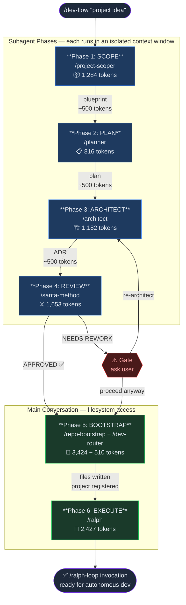
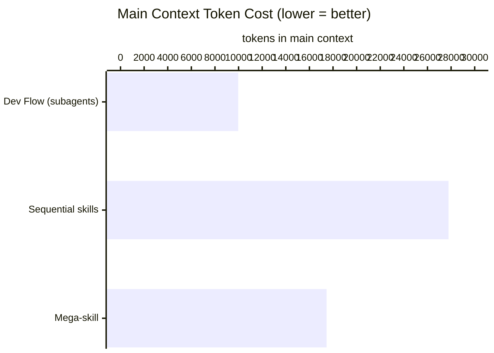
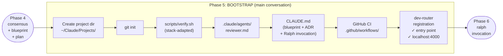
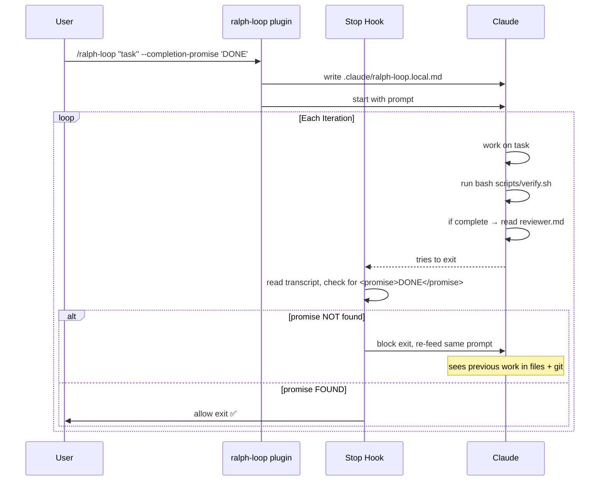

# Dev Flow — Architecture Diagrams

## 1. Full Pipeline



---

## 2. Subagent Context Isolation

Why each thinking phase runs in its own agent:

```mermaid
block-beta
  columns 5

  block:MAIN["Main Context\n~9,972 tokens\n(stays lean)"]:1
    O["dev-flow\norch.\n2,348"]
    S1["summary\n500"]
    S2["summary\n500"]
    S3["summary\n500"]
    S4["summary\n400"]
  end

  ARROW1<[" "]:right>:1

  block:A1["Subagent 1\n~39K used\nthen released"]:1
    SK1["project\n-scoper\n1,284"]
    W1["deep\nwork\n8K+"]
  end

  block:A2["Subagent 2\n~39K used\nthen released"]:1
    SK2["planner\n816"]
    W2["deep\nwork\n8K+"]
  end

  block:A3["Subagent 3\n~40K used\nthen released"]:1
    SK3["architect\n1,182"]
    W3["deep\nwork\n10K+"]
  end

  A1-- "→ 500 tok" -->MAIN
  A2-- "→ 500 tok" -->MAIN
  A3-- "→ 500 tok" -->MAIN
```

---

## 3. Token Budget: Dev Flow vs Alternatives



---

## 4. Skill Map

```mermaid
graph LR
    DF["🎯 /dev-flow\norchestrator"]

    subgraph PIPELINE["Pipeline Skills"]
        PS["📦 /project-scoper\nclassify + filter scope"]
        PL["📋 /planner\nphases + steps"]
        AR["🏗 /architect\nsystem design + ADRs"]
        SM["⚔️ /santa-method\nadversarial review"]
        RB["🔧 /repo-bootstrap\nverify.sh + reviewer + CLAUDE.md"]
        RA["🚀 /ralph\ngated autonomous loop"]
        DR["🖥 /dev-router\nlocal launcher registration"]
    end

    subgraph ONDEMAND["On-Demand (not orchestrated)"]
        FD["🎨 /frontend-design"]
        WG["🔍 /web-design-guidelines"]
        SA["🔎 /skill-agent"]
    end

    DF -->|"Phase 1"| PS
    DF -->|"Phase 2"| PL
    DF -->|"Phase 3"| AR
    DF -->|"Phase 4"| SM
    DF -->|"Phase 5"| RB
    DF -->|"Phase 5"| DR
    DF -->|"Phase 6"| RA

    PS -.->|"blueprint"| PL
    PL -.->|"plan"| AR
    AR -.->|"ADR"| SM
    SM -.->|"consensus"| RB

    RA -.->|"during dev"| FD
    RA -.->|"during dev"| WG
    RA -.->|"when stuck"| SA

    style DF fill:#7c3aed,color:#fff
    style ONDEMAND fill:#1a1a2e,stroke:#555
```



---

## 5. Phase 5 Detail: Bootstrap + Dev Router



---

## 6. Ralph Loop Mechanism

How Ralph differs from `/loop`:


